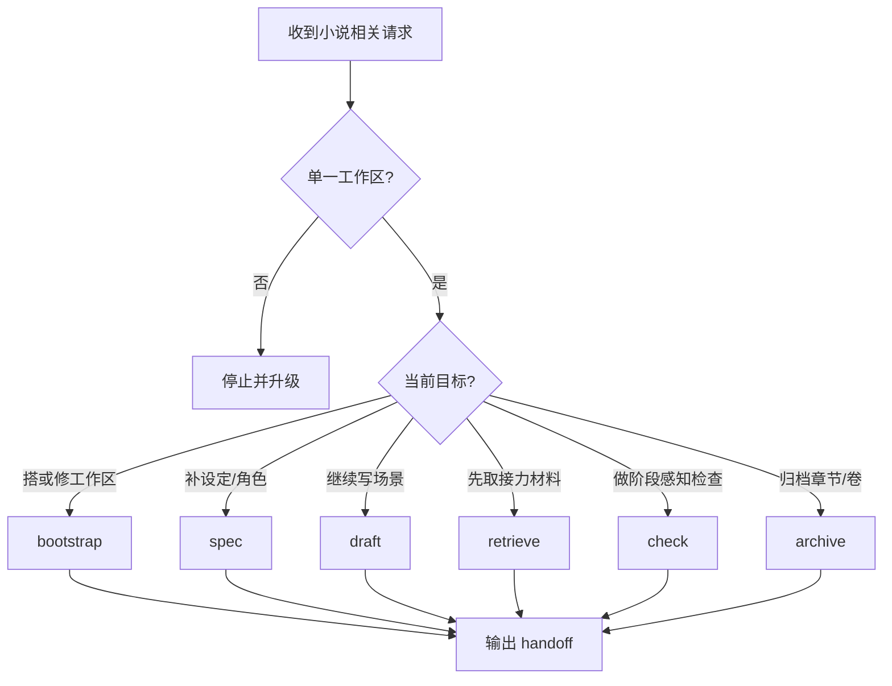

# Task Fit

在以下情况触发：

1. 搭建或修复单小说工作区。
2. 更新 `WORK.md`、`设定/`、`角色/`、`正文创作区.md`、归档树。
3. 判断当前该先 `retrieve`、`draft`、`check` 还是 `archive`。
4. 继续写某个 scene，或在续写前取 context pack。
5. 判断当前 scene 是否还能留在 `draft`、是否能进 `ready`、是否能归档。

不要在以下情况触发：

1. 只想写一段独立片段，不要项目合同和长期维护。
2. 只讨论文学理论、题材分析、作品比较或文风建议。
3. 只问通用 Python、CLI、argparse 或 OpenAI API 用法。
4. 同时维护多个小说工作区，而不是先收敛到一个仓库。

# Resources to Load

按需读取，不要默认全读：

- 需要确认固定目录树和真源边界时，读 [references/workspace-contract.md](references/workspace-contract.md)。
- 需要确认 `WORK.md` frontmatter、正文索引和 handoff 约束时，读 [references/project-state-contract.md](references/project-state-contract.md)。
- 需要确认 `scene block` 写法时，读 [references/scene-schema.md](references/scene-schema.md) 与 [references/scene-writing-rubric.md](references/scene-writing-rubric.md)。
- 需要解释 `pending_by_stage / review_required / blocking / readiness` 时，读 [references/consistency-checks.md](references/consistency-checks.md)。
- 需要说明 retrieval / context-pack 输出时，读 [references/retrieval-views.md](references/retrieval-views.md)。
- 需要选命令、跑 smoke test 或对照 CLI 输出时，读 [references/cli-usage.md](references/cli-usage.md)。
- 只有在初始化工作区时，才使用 `assets/workspace/` 模板。

# Inputs

进入流程前先确认：

1. 当前只涉及一个小说工作区。
2. 当前目标属于哪条路径：`bootstrap / spec / draft / retrieve / check / archive`。
3. `WORK.md` 是否存在且能解析。
4. `设定索引` 与 `角色索引` 是否登记到正确文件。
5. `正文创作区.md` 是否存在且 scene block 合法。

缺输入时按以下顺序处理：

1. 没工作区但允许初始化时，走 `bootstrap`。
2. `WORK.md` 缺失或损坏时，先走 `check`，不要直接续写。
3. 设定或角色真源未登记时，先修 `WORK.md` 索引。
4. 设定真源仍是占位内容时，先走 `spec`，不要硬续写。

# Workflow

默认主链路：

`bootstrap -> spec/retrieve -> draft -> check -> ready/hold -> archive chapter -> archive volume`

# Branches

## Stage-Aware Gates

- `bootstrap-incomplete`
  - 允许设定和正文未完成。
  - 这是 pending，不是失败。
- `draft-ready`
  - 当前已满足继续创作和接力的最小合同。
- `archive-ready`
  - 前部连续 `ready` scenes 满足章节归档阈值，且没有 blocking。

## Common Pivots

- `draft -> retrieve`
  - continuity、设定线索或最近 blocker 不清时。
- `draft -> spec`
  - 设定真源仍是占位，或者 `WORK.md` 索引不完整时。
- `check -> spec`
  - 缺世界观/主线规格/时间线，或链接索引失效时。
- `check -> draft`
  - prose、summary、beats、state_changes 不一致时。
- `check -> archive`
  - 只有 `archive-ready` 才允许进入。

# Quality Gates

1. Routing Gate
   - 当前请求已被映射到单一路径，并说明为什么不是其它路径。
2. Contract Gate
   - `WORK.md` frontmatter、固定章节、`设定索引`、`角色索引`、单文件正文都能稳定解析。
3. Source Gate
   - `设定/` 与 `角色/` 里的真源文件都已在 `WORK.md` 登记，没有坏链、重复链或越界链。
4. Stage Gate
   - 区分 `pending_by_stage`、`review_required`、`blocking`，不要混成一个失败信号。
5. Draft Gate
   - scene 结构完整，正文与 beats/summary/事实卡片同步。
6. Archive Gate
   - 只消费 `正文创作区.md` 前部连续 `ready` scenes，并写入当前卷目录树。
7. Evidence Gate
   - 凡涉及 `status / check / retrieve / archive / report`，最终结论必须能指向实际命令结果。

# Done Definition

满足以下之一才算完成：

- `bootstrap`：工作区已可进入下一条路径。
- `spec`：当前 draft 所需设定与角色真源已登记并补齐到可接力状态。
- `draft`：scene 完成并给出明确 ready decision。
- `retrieve`：已交付可直接接力的 context pack / typed retrieval。
- `check`：已给出 `pending / review-required / blocking` 的阶段性判断和回流路径。
- `archive`：章节或卷归档完成，正文区或卷总结已回写并重新同步。

# Handoff

结束时固定交付：

1. `chosen path`
2. `current stage`
3. `current blockers`
4. `reroute happened or not`
5. `source files touched / read-only`
6. `last verified command`
7. `recommended next step`

# Output Standard

- 先给当前路径、阶段、是否 reroute，再给动作、结果和下一步。
- 清楚区分真源、runtime、cache。
- `WORK.md` 是项目状态和真源索引中枢；`设定/` 与 `角色/` 是人类真源；`.novel/runtime/` 是可重建 runtime。
- 不要声称存在结构化世界知识校验；当前版本只做索引一致性、scene 一致性和归档连续性检查。

# Stop Conditions

- 不是单小说工作区。
- 用户明确不要工作区合同，只要一段片段文本。
- `WORK.md` 长期损坏且用户不允许修复。
- 链接索引和真源文件冲突到无法判断哪一份才是真源。

# Minimal Examples

正例：

1. “帮我搭一个长篇小说工作区，用 `WORK.md` 管项目状态和索引。”
2. “先检查这个仓库现在还能不能继续写，再给我一个 handoff context pack。”

边界例：

1. “给我随手写一个赛博朋克开头，不要目录、不要 WORK、不要检查。”
2. “我只想聊聊悬疑小说的节奏控制。”
