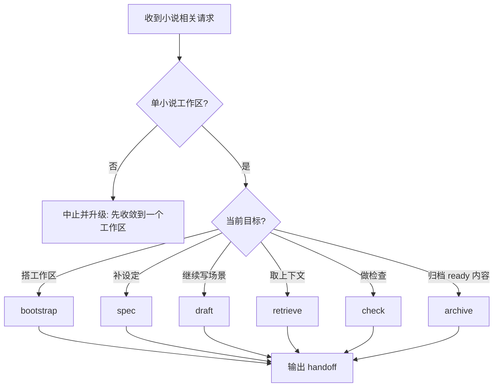
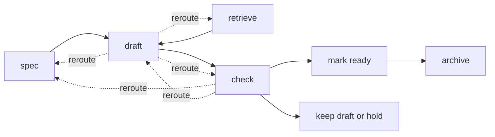

# Task Fit

在以下真实用户意图下触发本 skill：

1. “帮我搭一个长篇小说工作区，先把设定、正文创作区和项目 AGENTS.md 建起来。”
2. “先把世界观、主线规格、时间线补到后面能继续写。”
3. “这场戏现在能不能写，还是要先补设定或先查上下文。”
4. “继续写这场戏，先给我 context pack / beats / prose。”
5. “这场戏写完能不能进 `ready`，还是该继续留在 `draft`。”
6. “检查一下 continuity、blocking errors、review_required、conflict candidates。”
7. “把前部连续 `ready` 场景归档成章节，顺便判断能不能继续抽卷。”

不要在以下情况触发：

1. 只想随手写一段开头或片段，不需要项目文件和长期维护。
2. 只讨论文学理论、题材分析、作品比较或风格建议。
3. 只问通用 CLI、argparse、Python 工具链知识。
4. 需要同时维护多个小说工作区，而不是先收敛到单一仓库。
5. 只想要文风建议，不要任何仓库流程、结构字段或 continuity 约束。

这个 skill 的起点是一个单小说工作区，或一个允许初始化的目标目录；终点是选定单一路径，必要时明确 reroute，并交付下一步可接力状态。

# Resources to Load

按需读取，不要默认全读：

- 需要确认目录边界、Git 真源、runtime/cache 层时，读取 [references/workspace-contract.md](references/workspace-contract.md)。
- 需要写或修结构化场景块，或判断 `status` 字段是否合法时，读取 [references/scene-schema.md](references/scene-schema.md)。
- 需要继续写某一场戏、判断 `draft -> ready`、解释为什么应该 keep draft / reroute 时，读取 [references/scene-writing-rubric.md](references/scene-writing-rubric.md)。
- 需要取 context pack、选择 typed retrieval 视角时，读取 [references/retrieval-views.md](references/retrieval-views.md)。
- 需要解释 `errors`、`warnings`、`review_required`、`conflict_candidates`，以及这些结果应把任务转去哪里时，读取 [references/consistency-checks.md](references/consistency-checks.md)。
- 需要选命令、确认 freshness / fallback、做安装或 smoke test 验证时，读取 [references/cli-usage.md](references/cli-usage.md)。
- 只有在初始化或修复工作区时，才使用 `assets/workspace/` 模板或 `novelctl init`。

# Inputs

进入流程前，先回答以下执行问题：

1. 当前工作区在哪里，或用户是否允许在目标目录执行 `bootstrap`。
2. 当前要处理的是哪一个工作单元：某一场戏、某一段设定、某次检查、某次归档。
3. 当前任务要推进哪条 plotline、哪一个问题，或解决哪一个阻塞。
4. 用户此刻要的是“直接写”，还是“先查再写 / 先补设定再写 / 先检查再决定”。
5. 当前请求是否只涉及单一小说工作区，且真源文件可以明确定位。
6. 当前路径是否依赖 runtime freshness 或 semantic retrieval；若 semantic 不可用，是否接受 lexical fallback。

若输入缺失，按以下顺序处理：

1. 缺工作区但允许初始化时，走 `bootstrap`。
2. 缺工作区且用户不允许初始化时，中止。
3. 无法判断真源时，中止并升级给用户。
4. 缺结构化字段时，先补结构，再继续 `draft` 或 `archive`。
5. 缺 runtime 时，先 `sync`，或使用已遵守 freshness 契约的读命令。
6. 缺 semantic 配置时，继续 `retrieve`，但显式说明当前走 lexical fallback。

# Workflow

If the diagram does not render, use this path list:

1. `bootstrap`: 搭或修单小说工作区。
2. `spec`: 补世界观、主线规格、时间线和创作约束，让后续能写。
3. `draft`: 继续写某一场戏，并在结尾做 ready 决策。
4. `retrieve`: 先取 context pack 或最小足够材料，再决定怎么写或怎么修。
5. `check`: 看 blocking errors、review_required、conflict candidates，并决定回流方向。
6. `archive`: 把前部连续 `ready` 场景收进章节或卷。

## Scene Lifecycle

`scene lifecycle` 是本 skill 的核心默认心智模型：`spec/retrieve -> draft -> check -> ready/hold -> archive`。

### `bootstrap`

- Choose when:
  - 用户要从零搭长篇小说仓库，或现有工作区结构损坏。
- Default sequence:
  - 建工作区。
  - 建真源目录和 runtime 边界。
  - 写最小可用 `设定/`、`正文创作区.md`、`进展/`、项目 `AGENTS.md`。
- Done:
  - 后续 `spec`、`draft`、`retrieve`、`check` 能继续。
- Stop:
  - 不允许初始化时中止。

### `spec`

- Choose when:
  - 用户要补世界观、主线规格、时间线、冻结设定、当前创作约束。
- Default sequence:
  - 先锁定本轮要补的是哪一段设定，而不是泛泛“补世界观”。
  - 回答 `Spec Minimum` 的三个问题。
  - 更新 `设定/`，必要时同步项目 `AGENTS.md` 或 `进展/项目状态.md`。
- Done:
  - 后续 `draft` 不会因为关键设定缺失而停下。
- Stop:
  - 多份文档互相冲突且无法判断哪份为真源时中止。

### `draft`

- Choose when:
  - 用户要继续写某场戏、补场景 beats、把 context pack 转成正文。
- Default sequence:
  - gather context
  - define `goal / conflict / turn / outcome`
  - 列 beats
  - 写 prose
  - 做 structured sync
  - 做 ready decision
- Ready decision 只能显式给出以下之一：
  - `keep draft`
  - `mark ready`
  - `reroute to spec`
  - `reroute to retrieve`
  - `reroute to check`
- Done:
  - 场景正文与结构化字段一致，并明确给出 ready decision 与下一步。
- Stop:
  - 关键设定缺失、上游连续性断裂、blocking `errors` 未修时停止大规模续写。

### `retrieve`

- Choose when:
  - 用户要先查人物、地点、plotline、未解线索、冲突候选，或续写前先取最小上下文包。
- Default sequence:
  - 先确认 runtime freshness。
  - 优先用 typed retrieval 或 `report context-pack` 返回最小足够材料。
  - 若无 embedding，则使用 lexical fallback；这不是失败。
- Done:
  - 已给出来源可追踪的最小上下文包或检索结果，不必手动翻全仓库。
- Stop:
  - 无法定位真源或 runtime 无法重建时中止。

### `check`

- Choose when:
  - 用户要判断这场戏能不能继续写、能不能进 `ready`、能不能归档，或想核实 continuity 风险。
- Default sequence:
  - 先确保 runtime 新鲜。
  - 运行 `check` 或相关报告。
  - 把 `errors`、`warnings`、`review_required`、`conflict_candidates` 转成动作和回流路径。
- Done:
  - 用户知道当前能否继续、应先回 `spec` 还是回 `draft`，以及哪些问题必须先修。
- Stop:
  - 若请求要求在 blocking `errors` 存在时继续大规模续写或归档，明确拒绝。

### `archive`

- Choose when:
  - 用户要把前部连续 `ready` 场景归档成章节，或在条件满足时抽卷。
- Default sequence:
  - 确认只处理前部连续 `ready` 场景。
  - 执行章节或卷归档。
  - 归档后重新同步并重新检查。
- Done:
  - 归档结果生成，活跃正文已裁剪，并说明后续是否还能继续抽卷。
- Stop:
  - `ready` 边界不连续、卷阈值不满足或 blocking `errors` 存在时停止。

## Spec Minimum

对 `spec` 与依赖设定的 `draft`，至少确认以下三件事能够回答：

1. 当前场景涉及的世界规则是否明确，不会靠 agent 临场编一套新规则。
2. 主线目标和主要阻力是否明确，当前 scene 要推进的 plotline 不会失焦。
3. 当前 scene 所在的时间位置是否明确，至少能知道它相对上下游 scene 的先后。

# Branches

## Gotchas

- 只支持单小说工作区；跨多个仓库的请求先升级，不做批量处理。
- Markdown 真源才是 source of truth；`.novel/runtime/` 是可重建层，不要把 runtime 当真源改。
- blocking `errors` 会阻断大规模 `draft` 与 `archive`。
- 缺 embedding/reranker 不是失败，`retrieve` 可以走 lexical fallback。
- `retrieve` 是用户可见路径名；命令层面可以用 `novelctl retrieve` 或 `novelctl report`。
- `hold` 是源文件里的 scene 状态；handoff 里的显式结论仍然用 `keep draft` 或 `reroute ...`。

## Common Pivots

- `draft -> retrieve`
  - 当上下文不足、`continuity_refs` 不够、角色/地点/plotline 近期状态不清楚时，先转去取材料。
- `draft -> spec`
  - 当世界规则、主线目标、时间位置不明确，或关键设定冲突时，先补真源设定。
- `draft -> check`
  - 当怀疑已有 continuity 风险，或在 `mark ready` 前需要核实风险时，先做检查。
- `check -> spec`
  - 当问题根源是 canon 缺口、冻结设定冲突、时间线不清时，回到设定真源。
- `check -> draft`
  - 当问题根源是 scene 本身结构或 prose/summary/事实不同步时，回到场景。
- `check -> archive`
  - 只有 blocking `errors` 为空、ready 边界明确且 archive 条件满足时，才允许继续归档。

# Quality Gates

1. Routing Gate
   - 当前请求已被映射到单一路径，并说明为什么不是其它路径。
2. Spec Minimum Gate
   - 对 `spec` 与依赖设定的 `draft`，世界规则、主线目标、时间位置至少可回答。
3. Context Sufficiency Gate
   - 对依赖上下文的 `draft`、`retrieve`、`check`、`archive`，已有最小足够材料；若不足，显式 reroute。
4. Scene Ready Gate
   - 对 `draft` 与 `archive`，场景必填字段齐全、beats 与 prose 对齐、结构化字段已同步，并能给出明确 ready decision。
5. Consistency Gate
   - 对 `draft`、`check`、`archive`，`errors` 为空；`warnings`、`review_required`、`conflict_candidates` 已显式处理。
6. Archive Gate
   - 对 `archive`，只处理前部连续 `ready` 场景；卷抽取满足阈值并至少闭合一条情节线。

# Done Definition

满足以下之一才算本轮完成：

- `bootstrap` 完成：工作区结构可用，并能进入下一条路径。
- `spec` 完成：`Spec Minimum` 对当前任务成立。
- `draft` 完成：场景正文与结构化字段一致，并给出 `keep draft / mark ready / reroute ...` 结论。
- `retrieve` 完成：已返回最小足够上下文包或 typed retrieval 结果。
- `check` 完成：已给出是否可继续、当前该回 `spec` / `draft` / `archive` 的判断。
- `archive` 完成：已完成章节或卷归档，并重新同步检查。

# Handoff

结束时固定交付以下项目：

1. `chosen path`
2. `reroute happened or not`
3. `source files touched / read-only`
4. `latest sync/check state if relevant`
5. `unresolved items`
6. `recommended next step`

# Output Standard

- 先给“当前路径 + 是否发生 reroute + 为什么”，再给动作、结果和下一步。
- 让第一次读的人不打开 `references/` 也能知道现在该走哪条路径。
- 清楚区分真源改动、runtime 产物、embedding cache。
- 涉及检索时，结果必须带来源路径和 `scene_id/chapter_id/volume_id` 或等价 `source_ref`。
- 涉及检查时，明确区分 `errors`、`warnings`、`review_required`、`conflict_candidates`，并给出动作。
- 涉及创作时，正文推进与结构化字段同步更新，且 ready decision 必须显式。
- 涉及归档时，说明哪些内容已迁出活跃正文，以及归档后是否重新同步和检查。

# Stop Conditions

- 缺工作区且用户不允许初始化。
- 当前请求跨多个小说仓库。
- 结构化字段严重缺失，CLI 无法稳定提取。
- `check` 存在 blocking `errors`，但请求仍要求继续大规模续写或归档。
- 用户要求覆盖已归档大段内容，却没有明确回退策略。

# Minimal Examples

正例：

- “帮我搭一个长篇小说仓库，先把设定目录、正文创作区和项目 AGENTS.md 建起来。”
- “先把这本书的世界规则、主线规格和时间线补到后面能继续写。”
- “这场戏现在能不能写，还是要先补设定或先查上下文。”
- “继续写 scene-0012，先给我 context pack，再列 beats。”
- “这场戏写完能不能进 ready，还是应该继续留在 draft。”
- “检查一下这次 check 之后应该回 spec 还是继续 draft。”
- “把前面连续 ready 的场景归档成一章，然后告诉我能不能继续抽卷。”

反例或边界例：

- “随手写一段仙侠开头，不要目录和长期管理。”
- “比较《三体》和《基地》的叙事结构。”
- “只给我一点文风建议，不要仓库流程。”
- “教我 argparse 子命令怎么写。”
- “同时帮我维护这两个小说仓库的设定和归档。”
